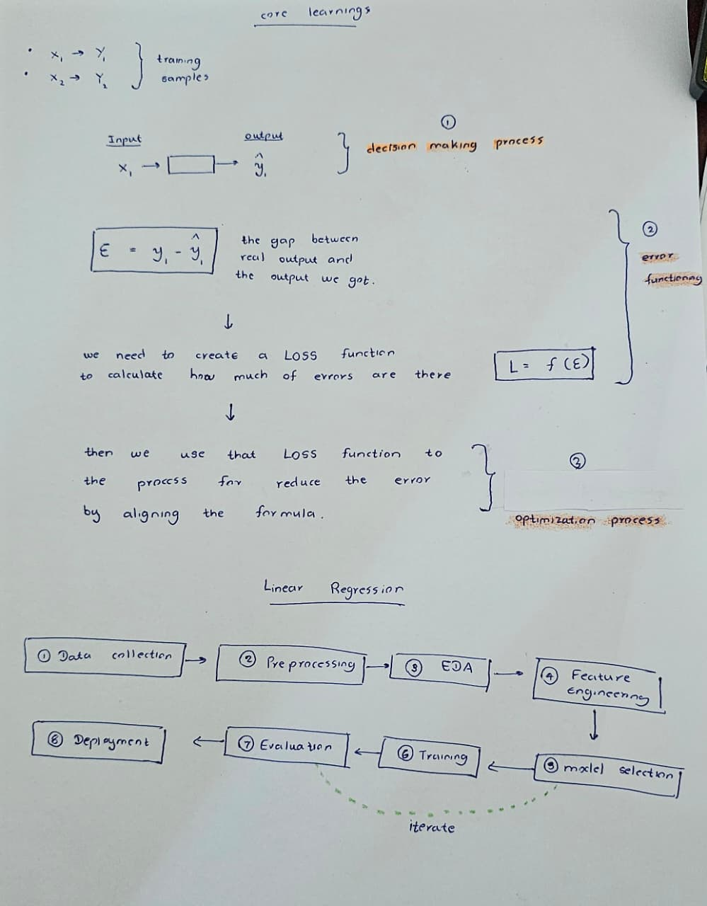
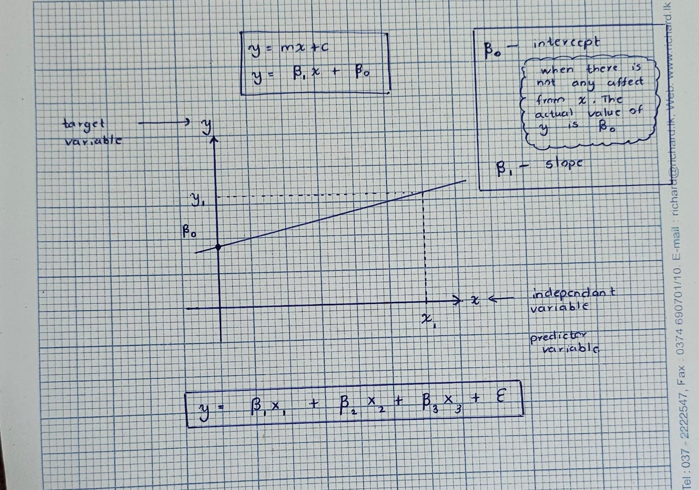
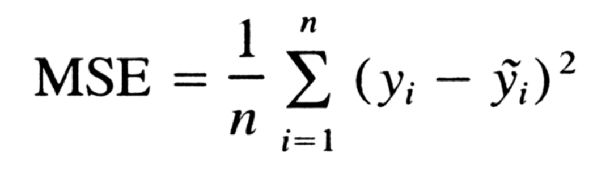
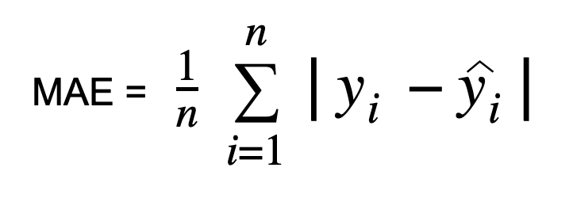
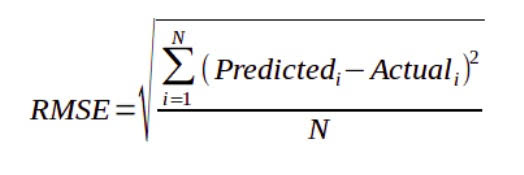

# Week 02 - ML basics and linear regression

## Key concepts

- In ML we train a model without knowing the correct formula. but we have some data. It means a relationship which we cannot find in the natural world, but we try to guess it using data related that.
- 4 sub domains in ML
  - Supervised Learning - using labled data
  - Unsupervised Learning - using unlabled data
  - Semi-supervised Learning - using labled data and unlabled data
  - Reinforcement Learning - we provide rewards within a controlled environment for models actions what they do and let them to learn themselves
- 
- 
- Mean squared error (MSE) measures the average squared difference between a model's predicted values and the actual true values. 
- Mean absolute error (MAE) is a statistical measure that calculates the average magnitude of the absolute differences between predicted and actual values. 
- Root mean square error (RMSE) measures the average difference between a model's predicted values and the actual observed values. 

## What I learnt

- In ML, there are 3 core learnings called
  - decision making
  - error functioning
  - optimization process.
- linear regression, we assume the best hyperplane which our data can be matched.
- When we training the model, if at one point we cannot do further, it means the relationship betrween real data are very complex.
- There are types of linear regression
  - Simple linear regression
  - Multiple linear regression
- The sum of total errors (residuals) in standard linear regression using ordinary least squares always equals zero when un-squared, because positive and negative errors cancel each other out.

## Practical / code

- in code, we imported the relavents and cleaned the data for further step

## Assignment / homework

<!-- Brief description of the assignment and where the files live. Delete if none. -->

-

## Questions / things to revisit

- No questions
