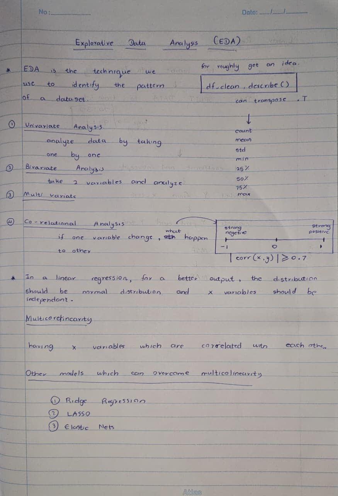
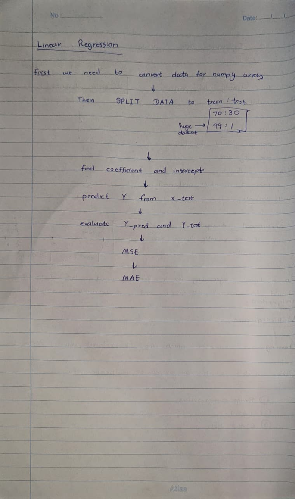

# Week 02 - ML basics and linear regression

## Key concepts

## What I learnt

- 1. Target Leakage

    - Y1 was accidentally used as an input feature.

    - The model ended up predicting Y1 using Y1 itself.

    - This led to a result that looked perfect but was completely fake.

- 2. Warning Signs

    - An R² of 1.00 and an RMSE close to zero are warning signs.

    - These values show that the model was just copying the target instead of learning anything real.

- 3. Important Features

    - Overall Height (X5) and Roof Area (X4) are the strongest predictors of Heating Load (Y1).

    - Taller buildings usually need more heating, so Heating Load increases with height.

- 4. Two Heating Load Groups

    - Heating Load splits into two main groups.

    - This happens because there are two building heights: 3.5 meters and 7.0 meters.

- 5. Redundant Features

    - X1 and X2 are almost exact opposites (correlation = -0.99).

    - This is because the total volume of the buildings stays the same.

- 6. Model Fix

    - Remove Y1 from the input features before training.

    - Then the model can actually learn the relationships between X1 to X7 and Heating Load.

## Practical / code

- Notebook ---> `energy_efficiencyipynb`

 All Python code preprocessing steps, visualizations and model evaluation are included in the notebook

- Dataset Ingestion & Preprocessing

 UCI Energy Efficiency dataset was loaded using `ucimlrepo`

 Qualitative variables X6 (Orientation) and X8 (Glazing Area Distribution) were filtered, producing a cleaned dataframe named `df_clean`

- Exploratory Data Analysis

 KDE, ECDF and Violin plots were made for the features

 Regression scatter plots were created using `snsregplot`

 A correlation heatmap was produced using `snsheatmap`

- Model Training & Evaluation

 The data was split into 75 percent training data and 25 percent testing data

 `Random_state=42` was used to make the split reproducible

 A `LinearRegression()` model was trained on the data

 Model coefficients and the intercept were extracted

 MSE, RMSE and MAE were computed to evaluate the model performance

## Assignment / homework

### Task 3: Exploratory Data Analysis Findings

- Primary Predictors & Direction:

 Overall Height (X5) ---> positive correlation (r = +089)

 Taller buildings (70 m) generally have higher Heating Loads while shorter buildings (35 m) have lower Heating Loads

 Roof Area (X4) ---> strongest negative correlation (r = -086)

 Larger roof areas generally have lower Heating Loads while smaller roof areas can have much higher Heating Loads

 Secondary Features ---> moderate to weak relationships

 Surface Area (X2) has a negative relationship (r = -066) while Relative Compactness (X1) Wall Area (X3) and Glazing Area (X7) have positive relationships

- Relationship Shapes:

 Overall Height (X5) & Glazing Area (X7) ---> step-wise relationships

 X5 has two height levels: 35 m and 70 m X7 has four values: 00, 010, 025 and 040

 Relative Compactness (X1) & Surface Area (X2) ---> non-linear relationship

 These variables have a relationship because they are physically related

- Distribution & Skewness:

 Heating Load (Y1) ---> two main groups

 Heating Load mainly falls around 13–14 kWh/m² and 30–32 kWh/m²

 Wall Area (X3) ---> mostly concentrated around 300–320 m²

 Most values are around 300–320 m², with a smaller group around 4165 m²

 Outliers ---> no major unusual values

 The data does not contain major unusual points because it comes from controlled computer simulations

- Multicollinearity:

 Relative Compactness (X1) & Surface Area (X2) ---> almost perfect negative relationship (r = -099)

 This strong relationship occurs because the variables are mathematically related and the building volume is fixed

 Roof Area (X4) & Overall Height (X5) ---> strong negative relationship (r = -097)

 Taller buildings generally have smaller roof areas

 Glazing Area (X7) ---> no relationship, with other geometric features (r = 000)

 Glazing Area behaves independently from the other geometric variables

### Model Performance

- Variance Explained (R²): 100 (one hundred percent of variance is explained)

- Prediction Error (RMSE): 214 × 10⁻¹⁴ kWh/m², which is essentially zero

- Interpretation: The model seems to predict Heating Load perfectly However this outcome is due, to Y1 being used as a predictor while predicting Y1 Thus this is not an indicator of genuine predictive ability

### Parameter Interpretation

- Predictor Coefficients ---> zero for all predictors (X1–X7)

 Predictor Coefficients show that a one‑unit change in any architectural predictor produces almost no change, in the predicted Heating Load

- Intercept ---> approximately 100

 Intercept represents the predicted value when all predictors are zero

 However Intercept is not a realistic building condition so Intercept has little practical meaning

- Overall Interpretation ---> model is affected by target leakage

 Y1 was incorrectly included in the input features while Y1 was also the target

 Therefore model learned to predict Y1 using Y1 itself

 This explains the R² = 100, almost‑zero coefficients and small RMSE

 Y1 should be removed from the input features to obtain coefficients and valid model performance

## Questions / things to revisit

- No questions
